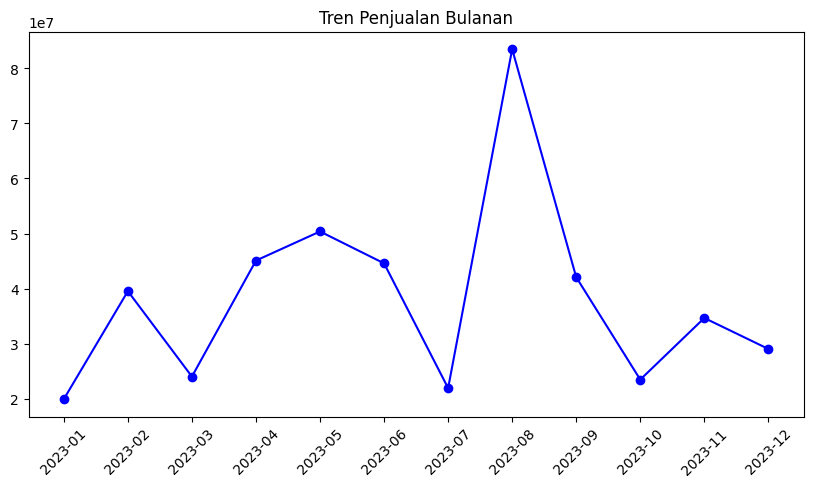
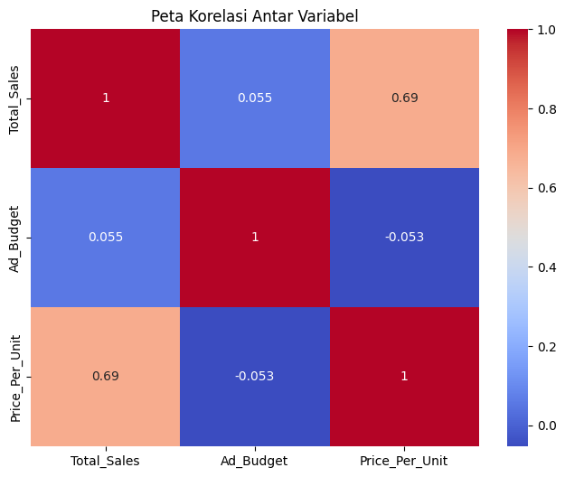
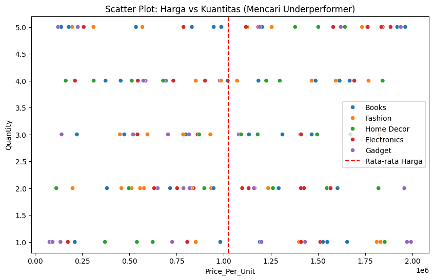
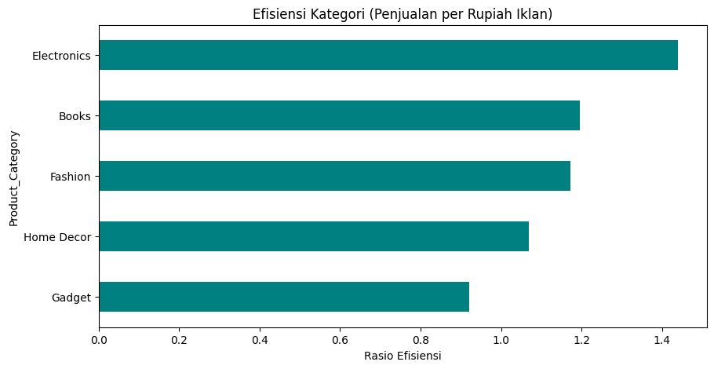

# 📊 Proyek Analisis Data Penjualan E-commerce


---

## 👤 Identitas Peserta Didik

| Field | Keterangan |
|-------|------------|
| **Nama** | FADI ALYULIANSYAH |
| **Kelas** | XI RPL 5 |
| **Absen** | 13 |
| **Sekolah** | SMK TELKOM MALANG |
| **Tahun Ajaran** | 2025/2026 |

---

## 📖 Overview

Dataset ini berisi data penjualan sintetis dari perusahaan e-commerce hipotetis. Includes information about orders, products, customers, and purchase details.

## 📋 Deskripsi Dataset

### Columns
- `Order ID`: A unique identifier for each order.
- `Product Name`: The name of the product.
- `Category`: The category of the product.
- `Price`: The price of a single unit of the product.
- `Quantity`: The quantity of the product ordered.
- `Total Sales`: The total sales amount for the order (price * quantity).
- `Customer ID`: A unique identifier for each customer.
- `Customer Age`: The age of the customer.
- `Customer Gender`: The gender of the customer.
- `Purchase Date`: The date of the purchase.
- `Purchase Time`: The time of the purchase.

---

# 📈 Laporan Praktikum: Analisis Performa Penjualan E-commerce

## 1. Business Question ❓
Analisis ini dilakukan untuk menjawab beberapa pertanyaan kunci bisnis guna mengoptimalkan strategi penjualan dan pemasaran:
* Bagaimana tren penjualan bulanan selama periode berlangsung?
* Apakah terdapat korelasi kuat antara anggaran iklan (`Ad_Budget`) dengan total penjualan?
* Produk mana saja yang tergolong "Underperformer" (harga tinggi namun kuantitas rendah)?
* Bagaimana segmentasi pelanggan berdasarkan metode RFM (Recency, Frequency, Monetary)?
* Kategori produk mana yang memberikan efisiensi tertinggi terhadap biaya iklan?
* Apakah peningkatan anggaran iklan berpengaruh secara signifikan terhadap rata-rata penjualan?

## 2. Data Wrangling 🧹
Sebelum melakukan analisis, dilakukan proses pembersihan dan transformasi data (Data Wrangling) sebagai berikut:
* **Pengecekan Data:** Memastikan tidak ada data kosong yang mengganggu proses perhitungan.
* **Filtering:** Menghapus baris data yang memiliki harga satuan (`Price_Per_Unit`) kurang dari atau sama dengan 0 untuk menghindari data anomali.
* **Transformasi Waktu:** Mengonversi kolom `Order_Date` menjadi format *datetime* agar dapat dilakukan ekstraksi periode bulan dan perhitungan *Recency* pada analisis RFM.

## 3. Insights (Analisis & Visualisasi) 📊

### A. Tren Penjualan & Korelasi 📊📈

*Insight: Grafik di atas menunjukkan fluktuasi penjualan bulanan. Tren ini membantu perusahaan memahami periode puncak (peak season) dan masa lesu.*


*Insight: Berdasarkan heatmap, kita dapat melihat kekuatan hubungan antar variabel. Jika korelasi `Ad_Budget` dan `Total_Sales` mendekati 1, maka strategi iklan terbukti sangat efektif dalam mendorong omzet.*

### B. Identifikasi Produk Underperformer 🚨

*Insight: Melalui scatter plot ini, produk di sebelah kanan garis merah (rata-rata harga) yang berada di posisi bawah menunjukkan produk bernilai tinggi yang sulit terjual dalam jumlah banyak. Ini adalah kelompok produk yang membebani inventaris.*

### C. Segmentasi Pelanggan (RFM Analysis) 🏷️
Berdasarkan skor RFM (1-5), setiap pelanggan diberikan label unik.
* **Pelanggan Loyal (Skor 555):** Pelanggan yang baru saja belanja, sering bertransaksi, dan nilai belanjanya besar.
* **Pelanggan Berisiko:** Pelanggan dengan skor *Recency* rendah (1) yang sudah lama tidak melakukan transaksi.

### D. Efisiensi Iklan Per Kategori 💵

*Insight: Bar chart ini menunjukkan rasio penjualan yang dihasilkan dari setiap rupiah iklan. Kategori dengan efisiensi tertinggi adalah prioritas utama untuk investasi pemasaran di masa depan.*

### E. Uji Hipotesis Pengaruh Iklan 🧬
Berdasarkan perbandingan rata-rata penjualan antara kelompok iklan tinggi (di atas median) dan iklan rendah:
* **Hasil:** Jika rata-rata penjualan iklan tinggi > iklan rendah, maka perusahaan secara valid dapat menyimpulkan bahwa iklan memiliki dampak positif yang signifikan.

## 4. Recommendation 💡
Berdasarkan hasil analisis, berikut adalah rekomendasi strategis bagi perusahaan:
1.  **Optimasi Anggaran:** Alokasikan budget iklan lebih besar ke kategori produk yang memiliki nilai efisiensi tinggi (berdasarkan hasil Tugas 3).
2.  **Strategi Produk Underperformer:** Lakukan promo khusus, diskon, atau *bundling* untuk produk yang memiliki harga tinggi namun volume penjualan rendah guna meningkatkan arus kas.
3.  **CRM & Loyalitas:** Berikan insentif khusus atau program poin untuk segmen pelanggan RFM terbaik (skor 555) agar mereka tetap setia dan tidak beralih ke kompetitor.
4.  **Reaktivasi Pelanggan:** Targetkan pelanggan dengan skor *Recency* rendah melalui kampanye email marketing "We Miss You" untuk memicu transaksi kembali.

---

## 🛠️ Teknologi yang Digunakan

| Teknologi | Deskripsi |
|-----------|------------|
| 🐍 Python | Bahasa pemrograman utama |
| 📊 Pandas | Manipulasi dan analisis data |
| 📉 Matplotlib/Seaborn | Visualisasi data |
| 🔬 Scipy/Statsmodels | Analisis statistik |

---

## ⚡ Cara Menjalankan Program

```bash
python praktikumPenjualan.py
```

---

## 📁 Struktur File

```
├── data_praktikum_analisis_data.csv   # Dataset utama
├── ecommerce_sales_data.csv           # Dataset penjualan e-commerce
├── praktikumPenjualan.py              # Script analisis data
├── README.md                          # Dokumentasi proyek
└── Foto/                              # Folder hasil visualisasi
```

---

*🎓 Dikembangkan sebagai bagian dari praktikum analisis data - SMKN 1 Kota Bekasi*
